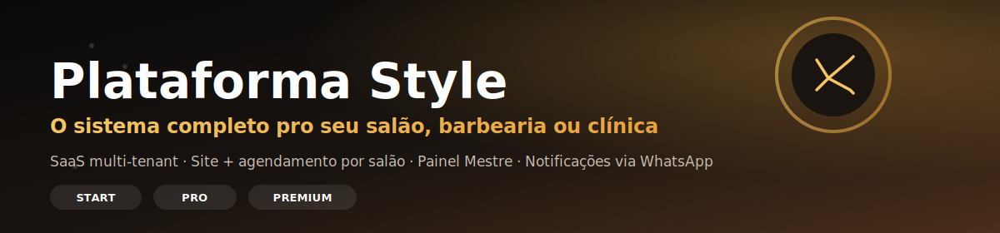
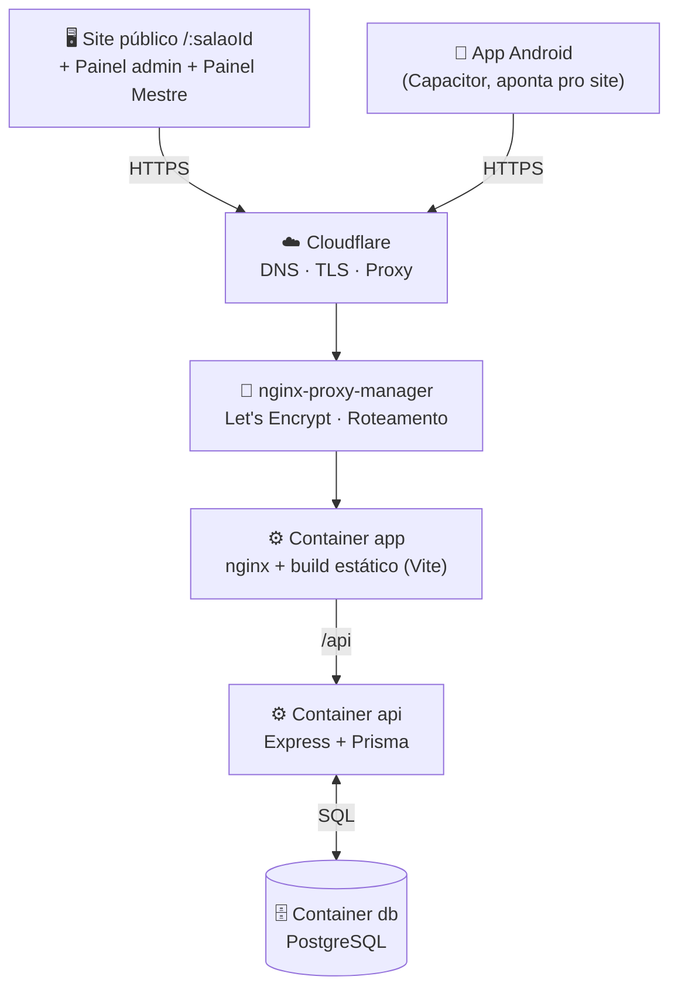
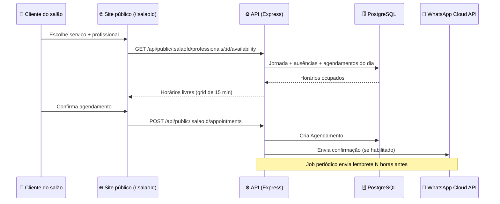
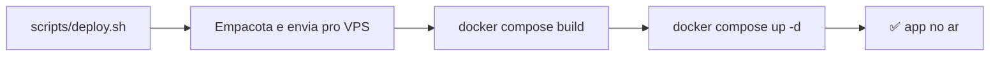

<div align="center">



<br/>


**[🌐 Ver a plataforma](https://salao.andre-aguiar-jr.com.br)** ·
**[📚 Documentação](#-índice)** ·
**[🧭 Roadmap](#-roadmap)** ·
**[🔌 API](#-api)** ·
**[🐛 Issues](../../issues)** ·
**[🏷️ Releases](../../releases)**

</div>

<br/>

<div align="center">
  <h1>💈 Plataforma Style</h1>
  <p><strong>O sistema completo pro salão, barbearia ou clínica de estética de outra pessoa.</strong></p>
  <p>
    SaaS <strong>multi-tenant</strong>: cada salão assinante ganha site público, agendamento
    online e painel administrativo — tudo gerido de um <strong>Painel Mestre</strong> central.
  </p>
</div>

<div align="center">

|                                            |                                              |                                                    |
| :----------------------------------------: | :-------------------------------------------: | :--------------------------------------------------: |
| 🏢 **Multi-tenant**<br/>1 plataforma, N salões | 📅 **Agendamento**<br/>wizard público, sem login | 📲 **WhatsApp**<br/>confirmação, lembrete, cancelamento |

</div>

---

## 📖 Índice

- [Sobre o projeto](#-sobre-o-projeto)
- [Demonstração](#-demonstração)
- [Funcionalidades](#-funcionalidades)
- [Planos](#-planos)
- [Tecnologias](#-tecnologias)
- [Arquitetura](#-arquitetura)
- [Fluxo do sistema](#-fluxo-do-sistema)
- [Estrutura do projeto](#-estrutura-do-projeto)
- [Roadmap](#-roadmap)
- [Instalação](#-instalação)
- [Variáveis de ambiente](#-variáveis-de-ambiente)
- [API](#-api)
- [Banco de dados](#-banco-de-dados)
- [Deploy](#-deploy)
- [App Android](#-app-android)
- [Segurança](#-segurança)
- [Performance](#-performance)
- [Responsividade](#-responsividade)
- [Licença](#-licença)

---

## 🎯 Sobre o projeto

**Plataforma Style** é um SaaS de agendamento para salões de beleza, barbearias e clínicas de
estética. Cada salão assinante (`Salao`) recebe um site público próprio, um assistente de
agendamento e um painel administrativo — todos isolados por salão dentro do mesmo banco de dados.
Uma equipe da plataforma (papel `MESTRE`) cadastra e administra os salões pelo **Painel Mestre**,
sem acesso ao painel operacional de cada cliente.

> [!NOTE]
> O nome do repositório (`gerenciador-loja`) é histórico — o produto em produção se chama
> **Plataforma Style**, como aparece no site e no código.

---

## 🎥 Demonstração

> [!TIP]
> A plataforma está no ar em **[salao.andre-aguiar-jr.com.br](https://salao.andre-aguiar-jr.com.br)**
> — a landing mostra os planos, e cada salão tem seu próprio site em `/:salaoId`.

<div align="center">

| Tela | Status |
| :--- | :---: |
| 🏠 Landing da plataforma | 🔜 GIF em breve |
| ✂️ Site público de um salão | 🔜 GIF em breve |
| 🗓️ Assistente de agendamento | 🔜 GIF em breve |
| 🖥️ Painel administrativo do salão | 🔜 GIF em breve |
| 👑 Painel Mestre | 🔜 GIF em breve |

</div>

<sub>Estrutura preparada para receber GIFs/capturas — sem prints falsos até lá.</sub>

---

## ✅ Funcionalidades

<table>
<tr><td>

**Site público do salão**
- ✅ Landing exclusiva por salão (`/:salaoId`)
- ✅ Templates por segmento (feminino, barbearia, unissex, estética)
- ✅ Blocos: hero, sobre, equipe, galeria, cortes feitos, avaliações, FAQ, contato, Instagram
- ✅ Personalização de copy/ordem dos blocos no plano PREMIUM

</td><td>

**Agendamento (sem login)**
- ✅ Wizard público de agendamento
- ✅ Cálculo de horários livres por profissional (grid de 15 min)
- ✅ Respeita jornada de trabalho e férias/ausências
- ✅ Busca de cliente por telefone (retorno rápido)
- ✅ Rate limit dedicado nas rotas públicas

</td></tr>
<tr><td>

**Painel administrativo (por salão)**
- ✅ CRUD de clientes, serviços e profissionais
- ✅ Vínculo opcional serviço ↔ profissional
- ✅ Horários de trabalho e ausências por profissional
- ✅ Gestão de agendamentos (status, observações)
- ✅ Login com sessão JWT em cookie httpOnly

</td><td>

**Painel Mestre (plataforma)**
- ✅ CRUD completo de salões assinantes
- ✅ Definição de plano, categoria e status do contrato
- ✅ Ativar/suspender salão
- ✅ Dados cadastrais/comerciais do cliente da plataforma

</td></tr>
<tr><td colspan="2">

**Notificações & Plataforma**
- ✅ WhatsApp (Cloud API oficial da Meta): confirmação, lembrete (job periódico) e cancelamento — opcional, desligado por padrão
- ✅ App Android via Capacitor, apontando para o site publicado
- ✅ Headers de segurança (helmet), rate limiting e CORS restrito

</td></tr>
</table>

---

## 💳 Planos

| Recurso | START | PRO | PREMIUM |
|---|:---:|:---:|:---:|
| Site de agendamento | ✅ | ✅ | ✅ |
| Painel administrativo | ✅ | ✅ | ✅ |
| Template exclusivo por segmento | ❌ | ✅ | ✅ |
| Personalização completa (copy/ordem/blocos) | ❌ | ❌ | ✅ |

> [!NOTE]
> Sem cobrança automática ainda — o plano é definido pelo Mestre ao cadastrar/editar o salão, e
> `RECURSOS_PLANO` (`backend/src/biblioteca/planos.js`) controla o que cada plano libera.

---

## 🛠️ Tecnologias

<div align="center">

**Frontend**


**Backend & Dados**


**Infraestrutura & Mobile**


</div>

<details>
<summary><strong>Bibliotecas específicas de cada frente</strong></summary>

<br/>

| Área | Biblioteca | Uso |
|---|---|---|
| Ícones | `lucide-react` | Ícones da interface |
| Autenticação | `bcryptjs` + `jsonwebtoken` | Hash de senha e sessão via JWT em cookie httpOnly |
| Validação | `zod` | Validação de entrada da API e das variáveis de ambiente |
| Segurança HTTP | `helmet`, `express-rate-limit`, `cors` | Headers, rate limit e CORS |
| Notificação | WhatsApp Cloud API (Meta), via `fetch` nativo | Confirmação/lembrete/cancelamento de agendamento |
| Mobile | `@capacitor/android`, `@capacitor/assets` | Empacota o site público como app Android |

</details>

---

## 🏗️ Arquitetura



Três containers Docker (`db`, `api`, `app`) numa rede interna própria por projeto, mais uma rede
`proxy` compartilhada com o nginx-proxy-manager. `trust proxy` no Express está fixado em 3 saltos
(Cloudflare → nginx-proxy-manager → nginx do container `app`), evitando que o próprio visitante
falsifique o IP via `X-Forwarded-For` e contorne o rate limit.

---

## 🔄 Fluxo do sistema



---

## 📁 Estrutura do projeto

```text
gerenciador-loja/
├── backend/
│   ├── src/
│   │   ├── controladores/       # regras de cada recurso (agendamentos, clientes, mestre...)
│   │   ├── rotas/                # mapeamento HTTP -> controlador
│   │   ├── middleware/           # autenticação, resolução de salão, tratamento de erros
│   │   ├── biblioteca/           # prisma client, disponibilidade, planos, whatsapp, job de lembrete
│   │   ├── utilitarios/          # jwt, senha, telefone, wrapper de rota assíncrona
│   │   ├── configuracao/         # validação de variáveis de ambiente (zod)
│   │   └── servidor.js / aplicacao.js
│   ├── prisma/                   # schema.prisma + migrations + seed
│   └── Dockerfile
├── frontend/
│   ├── src/
│   │   ├── paginas/
│   │   │   ├── site/              # landing da plataforma, site do salão, wizard de agendamento
│   │   │   ├── administrativo/    # painel do salão (clientes, serviços, agenda...)
│   │   │   └── mestre/             # painel mestre (CRUD de salões)
│   │   ├── componentes/blocos/    # blocos da landing por salão (hero, equipe, galeria, FAQ...)
│   │   ├── contextos/             # autenticação e contexto do salão atual
│   │   └── biblioteca/            # planos, helpers de API
│   ├── android/                   # app Android gerado via Capacitor
│   └── Dockerfile
├── deploy/
│   └── docker-compose.yml         # referência de produção (db + api + app)
└── scripts/
    └── deploy.sh                  # empacota, envia e reconstrói no VPS
```

---

## 🧭 Roadmap

<table>
<tr><th>✅ Concluído</th><th>🗺️ Planejado</th></tr>
<tr valign="top"><td>

- Multi-tenant com Painel Mestre completo
- Site público por salão com templates por segmento
- Assistente de agendamento com cálculo real de disponibilidade
- Painel administrativo (clientes, serviços, profissionais, agenda)
- Notificações via WhatsApp Cloud API
- App Android via Capacitor

</td><td>

- Domínio próprio por salão (`Salao.dominio` — resolução já existe, falta ativar em produção)
- Cobrança automática por plano (hoje é definido manualmente pelo Mestre)
- Publicação do app Android na Play Store

</td></tr>
</table>

---

## 🚀 Instalação

### Pré-requisitos


### Clone

```bash
git clone https://github.com/anndrehjr/gerenciador-loja.git
cd gerenciador-loja
```

### Backend

```bash
cd backend
cp .env.example .env   # preencher DATABASE_URL, JWT_SECRET etc.
npm install
npx prisma migrate deploy
npm run seed             # opcional — dados de exemplo
npm run dev               # http://localhost:4000
```

### Frontend

```bash
cd frontend
npm install
npm run dev               # http://localhost:5173 (proxy de /api para :4000)
```

### Testes

```bash
cd backend
npm run test
```

---

## 🔑 Variáveis de ambiente

| Variável | Obrigatória | Descrição |
|---|:---:|---|
| `DATABASE_URL` | ✅ | Connection string do PostgreSQL |
| `JWT_SECRET` | ✅ | Segredo para assinar o cookie de sessão (mínimo 32 caracteres) |
| `PORT` | Opcional | Porta da API (padrão `4000`) |
| `NODE_ENV` | Opcional | `development` \| `production` \| `test` |
| `COOKIE_NAME` | Opcional | Nome do cookie de sessão (padrão `salao_session`) |
| `COOKIE_SECURE` | ✅ em produção | Cookie só por HTTPS — obrigatório `true` quando `NODE_ENV=production` |
| `CORS_ORIGIN` | ✅ | Origem permitida pelo CORS |
| `WHATSAPP_ACCESS_TOKEN` | Opcional | Token da WhatsApp Cloud API — sem ele, notificações ficam desligadas |
| `WHATSAPP_PHONE_NUMBER_ID` | Opcional | ID do número de telefone na Cloud API |
| `WHATSAPP_API_VERSION` | Opcional | Versão da Graph API (padrão `v20.0`) |
| `WHATSAPP_REMINDER_HOURS_BEFORE` | Opcional | Antecedência do lembrete, em horas (padrão `24`) |

> [!NOTE]
> As variáveis de ambiente são validadas com `zod` na subida da API (`configuracao/ambiente.js`) —
> a aplicação recusa iniciar se algo obrigatório estiver ausente ou inválido.

---

## 🔌 API

<details open>
<summary><strong>Autenticação — <code>/api/auth</code></strong></summary>

| Rota | Descrição |
|---|---|
| `POST /api/auth/login` | Login (salão ou mestre) |
| `POST /api/auth/logout` | Encerra a sessão |
| `GET /api/auth/me` | Usuário autenticado atual |

</details>

<details>
<summary><strong>Painel do salão (autenticado) — <code>/api/clients</code>, <code>/api/services</code>, <code>/api/professionals</code>, <code>/api/appointments</code>, <code>/api/salon</code></strong></summary>

| Rota | Descrição |
|---|---|
| `GET/POST /api/clients` · `GET/PATCH/DELETE /api/clients/:id` | CRUD de clientes |
| `GET/POST /api/services` · `GET/PATCH/DELETE /api/services/:id` | CRUD de serviços |
| `GET/POST /api/professionals` · `GET/PATCH/DELETE /api/professionals/:id` | CRUD de profissionais |
| `PUT /api/professionals/:id/working-hours` | Substitui a jornada de trabalho |
| `POST/DELETE /api/professionals/:id/time-off[/:ausenciaId]` | Férias/ausências |
| `GET/POST /api/appointments` · `GET/PATCH/DELETE /api/appointments/:id` | CRUD de agendamentos |
| `GET/PATCH /api/salon` | Dados do salão do usuário logado |

</details>

<details>
<summary><strong>Site público de um salão — <code>/api/public/:salaoId</code></strong></summary>

| Rota | Descrição |
|---|---|
| `GET /salon` | Informações públicas do salão |
| `GET /services` · `GET /professionals` | Catálogo público |
| `GET /professionals/:id/availability` | Horários livres (rate limit dedicado) |
| `GET /clients/lookup` | Busca cliente por telefone |
| `POST /clients` | Cria cliente a partir do wizard |
| `POST /appointments` | Cria agendamento (rate limit dedicado) |

</details>

<details>
<summary><strong>Painel Mestre (papel <code>MESTRE</code>) — <code>/api/master</code></strong></summary>

| Rota | Descrição |
|---|---|
| `GET /salons` · `GET /salons/:id` | Lista/detalha salões assinantes |
| `POST /salons` | Cadastra novo salão |
| `PATCH /salons/:id` | Atualiza dados do salão |
| `PATCH /salons/:id/status` | Ativa/suspende o salão |
| `DELETE /salons/:id` | Remove o salão |

</details>

---

## 🗄️ Banco de dados

PostgreSQL via Prisma, schema em [`backend/prisma/schema.prisma`](backend/prisma/schema.prisma).

| Tabela | Papel |
|---|---|
| `Salao` | Cada assinante da plataforma — limite de isolamento de todo dado operacional |
| `Usuario` | Login do painel do salão (`ADMINISTRADOR`) ou da equipe da plataforma (`MESTRE`) |
| `Cliente`, `Servico`, `Profissional` | Cadastros operacionais, sempre vinculados a um `Salao` |
| `ServicoProfissional` | Vínculo opcional serviço ↔ profissional específico |
| `HorarioTrabalho`, `Ausencia` | Jornada de trabalho e férias/folgas por profissional |
| `Agendamento` | Reserva de um cliente com um serviço (e opcionalmente um profissional) |

> [!IMPORTANT]
> Todo modelo operacional carrega `salaoId` e é filtrado por ele em toda query — é esse campo,
> reforçado pelos middlewares `exigirSalao`/`resolverSalaoPorParametro`, que garante que um salão
> nunca enxergue dado de outro.

---

## 🚢 Deploy

Três containers Docker (`db`, `api`, `app`) via `deploy/docker-compose.yml`, atrás de Cloudflare +
nginx-proxy-manager. O banco publica porta só em `127.0.0.1` (não exposta para a internet).



```bash
./scripts/deploy.sh api    # só backend
./scripts/deploy.sh app    # só frontend
./scripts/deploy.sh all    # os dois
```

`deploy/docker-compose.yml` documenta a configuração de produção; os valores reais de servidor
(IP, chave SSH, caminho remoto) ficam fora do repositório, só no `scripts/deploy.sh` local.

---

## 📱 App Android

`frontend/android/` é um app Android gerado com [Capacitor](https://capacitorjs.com). Ele não
empacota o site — `frontend/capacitor.config.json` aponta `server.url` direto para a plataforma em
produção, então o app é uma casca nativa que sempre mostra a versão publicada do site (atualizar o
site atualiza o app sozinho, sem recompilar nada). Abre direto na página pública de agendamento,
sem exigir login.

Ícone e splash screen ficam em `frontend/resources/` (gerados com a identidade visual do produto) e
foram aplicados com `npx capacitor-assets generate --android`.

### Pré-requisitos

- [Android Studio](https://developer.android.com/studio) instalado (inclui o SDK do Android).
- Variáveis de ambiente `ANDROID_HOME` (pasta do SDK, ex. `%LOCALAPPDATA%\Android\Sdk`) e
  `JAVA_HOME` (JDK que vem junto do Android Studio, ex. `C:\Program Files\Android\Android Studio\jbr`).

### Rodar num emulador ou celular

```bash
cd frontend/android
./gradlew.bat installDebug     # compila e instala no emulador/dispositivo conectado (adb devices)
```

Ou abra a pasta `frontend/android` direto no Android Studio e clique em Run (▶ / Shift+F10).

### Gerar novo ícone/splash (se mudar a identidade visual)

```bash
cd frontend
npx capacitor-assets generate --android
```

Substitua antes `resources/icon.png` (1024×1024) e `resources/splash.png` / `splash-dark.png` (2732×2732).

### Publicar na Play Store (ainda não feito)

1. Criar conta de desenvolvedor no [Google Play Console](https://play.google.com/console) (taxa única de US$25).
2. Gerar uma chave de assinatura (`keytool` ou pelo Android Studio: **Build → Generate Signed Bundle/APK**) e guardá-la em local seguro — perder essa chave impede atualizar o app depois.
3. Gerar um **Android App Bundle** assinado (`./gradlew bundleRelease`) em vez do APK de debug.
4. Preencher a ficha da loja (nome, descrição, capturas de tela, política de privacidade) e enviar para revisão.

iOS não foi configurado: exige um Mac com Xcode (ou serviço de build na nuvem) e conta de
desenvolvedor Apple (US$99/ano).

---

## 🔐 Segurança

| Medida | Implementação |
|---|---|
| Isolamento entre salões | `salaoId` obrigatório em toda query operacional, reforçado por middleware |
| Senhas | Hash com `bcryptjs`, nunca em texto plano |
| Sessão | JWT em cookie **httpOnly**, `COOKIE_SECURE` obrigatório em produção |
| IP real do visitante | `trust proxy` fixado em 3 saltos — evita spoofing de `X-Forwarded-For` |
| Rate limiting | Global, dedicado em `/auth/login` e dedicado nas rotas públicas de agendamento |
| Headers HTTP | `helmet` |
| CORS | Restrito a `CORS_ORIGIN` configurado |
| Segredos | `.env` fora do controle de versão; variáveis validadas com `zod` na subida da API |
| Banco de dados | Porta publicada só em `127.0.0.1` no VPS — sem exposição externa |

---

## ⚡ Performance

- **Disponibilidade calculada em grid de 15 minutos**, com lógica pura testada isoladamente
  (`disponibilidade.test.js`), sem depender do banco para os cálculos de slot.
- **Rate limit diferenciado por rota** — disponibilidade (consultada a cada troca do wizard) tem
  limite mais generoso que agendamento/login, sem abrir mão de proteção.
- **Frontend em Vite** — build estático servido direto pelo nginx do container `app`.
- **Job de lembrete assíncrono**, fora do ciclo de requisição — não impacta o tempo de resposta da API.

---

## 📱 Responsividade

Frontend em Tailwind CSS, com o site público de cada salão e o assistente de agendamento pensados
para o celular (canal principal do cliente final) e o painel administrativo pensado para uso em
desktop/tablet no dia a dia do salão.

<div align="center">

| 💻 Desktop | 📱 Celular | 📟 Tablet |
|:---:|:---:|:---:|
| ✅ (painéis) | ✅ (site + agendamento + app Android) | ✅ |

</div>

---

## 📄 Licença

Projeto pessoal do autor. Nenhuma licença de código aberto foi formalizada até o momento — se a
intenção for abrir o código, adicione um arquivo `LICENSE` (ex. MIT) e atualize este badge.

---

<div align="center">

<sub>

**Plataforma Style** · v1.0.0 · O sistema completo pro salão, barbearia ou clínica de outra pessoa.

[🌐 Site](https://salao.andre-aguiar-jr.com.br) · [🐛 Issues](../../issues) · [🏷️ Releases](../../releases)

</sub>

</div>
